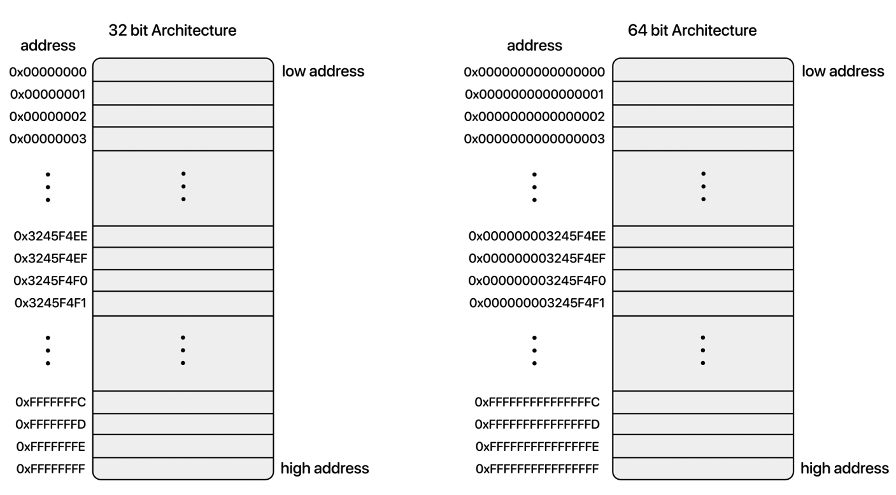

[bluestronica.github.io/C](https://bluestronica.github.io/C)

# 메모리 주소
### x86(32bit) 운영체제 용
- 32개의 비트
    - `0000 0000 0000 0000 0000 0000 0000 0000 ~ 1111 1111 1111 1111 1111 1111 1111 1111`
    - 4,294,967,296 (약 43억)
- 4,294,967,296개의 주소를 가릴킬 수 있다.
- 
- 메모리 한칸은 1바이트의 크기, 즉 **비트 하나의 크기는 1바이트가 된다.**
- 이는 1바이트 크기의 메모리가 4,294,967,296개 까지 인식이 가능하다는 것
- 즉, 메모리의 최대 크기는 4,294,967,296 = 4GB이다. 
- 16진수로 표현
    - `0x00000000 ~ 0xFFFFFFFF`
    - `0xFF00abcd`위치의 주소가 1바이트 증가하면 `0xFF00abce`
- 

# C-Style 문자열
### char[]로만 구성
- 문자열이 끝나는 곳에 널 문자(`\0`)를 붙인다
- 문자열 뒤에 별도로 `\0`를 넣지 않아도 컴파일러가 알아서 넣어준다.
    - `char str1[] = "abc";  // 스택에 "abc" 저장`
    - `char* str2 = "abc";   // 테이터 섹션에 "abc" 저장`
        - **자신이 바꾸지 않을 문자라면 이렇게 해도 상관없다.**
- 단, 이 경우는 `\0`을 넣어주지 않음
    - `char str[] = { 'a', 'b', 'c' };`
    - 문자열을 만드는데 배열 요소마다 지정해주면 컴파일러가 널 캐릭터를 만들어주지 않는다.

### 보통 C-Style 문자열이라 하면 널 문자(null character)로 끝나는 char 배열을 말한다.
- **널 문자**(null character, 널 캐릭터)
- 아스키코드 중에 화면에 출력되지 않는 특수 문자들이 있음
    - `0~31`, `127`
    - 그 중에 하나가 바로 `0`
    - `0`은 숫자 영
    - `\`는 이스케이프 문자
    - 근데 아스키코드로 `0`이니 `char null_char = 0`으로 작성 가능
    - **그.러.나** 읽기 쉽게 `\0`으로 써주자
- **널 포인터하고 다름** ; 헷갈리지 말자!

### 문자열의 길이는 3, 배열의 길이는 4
- `const char str[] = "abc";`
    - `|'a'|'b'|'c'|'\0'|`
    - 문자열의 길이는 3;
    - 배열의 길이는 4;
- 효율적인 문자열 길이 구하기
```c
#include <stdio.h>

size_t get_string_length(const char* str) // 읽기 전용으로 str 시작주소를 받음
{
    const char* p = str;    // const char* p는 그 주소가 가리키는 값을 보호  

    while (*p++ != '\0')		
    {
        // 값이 아니라,
        // p++는 포인터 p의 주소를 1만큼 증가 시키는 연산이기 때문에 
        // const char* p는 에러 없이 실행된다.
        // 하지만 *p의 값을 변경하려면 에러가 난다. 
        // 왜냐하면, const char* p는 
        // 그 주소가 가리키는 값의 변경을 보호하기 때문이다.
        // 참고로, int* const p = str;은 포인터 p가 가리키는 주소를 보호한다.
    }
    return p - str - 1;	  // 두 주소 간의 사칙연산은 뺄셈만 지원한다.
}

int main(void)
{
    char str[] = "abcd";  // 00 ef f8 14

    size_t count = get_string_length(str);

    printf("count: %d", count);

    return 0;
}
```

### C-Style 문자열의 장단점
- 장점
    - 가장 최소한의 메모리!
    - 한 가지 데이터형으로 문자열과 길이를 다 표현!
- 단점
    - 어떤 문자열의 길이를 알려면 배열을 끝까지 훑어야 함. O(N)


# C 문자열 함수들
### `<string.h>`에 있는 문자열 함수들
- strlen()
- strcmp() / strncmp()
- strcpy() / strncpy()
- strstr()
- strcat() /strncat()
- strtok()
- 그 외 다수 

### 특징
- 꽤 많은 함수들이 문자열을 절대 변경하지 않는다!
    - 매개변수에 **`const char*`** 붙인다.
- 문자열을 변경하더라도 원본은 변경 안 하려 한다!
    - 사본만 변경
    - 예외: strtok()
- 절대 새로운 문자열(즉, 연속된 char 메모리)을 만들어 주지 않는다!
    
### strlen() : 문자열 길이 구하는 함수
```c size_t strlen(const char* str);```
- 널캐릭터 없는 문자열을 무작정 읽으면 위험한 일이 일어날 수 있다.
- 그래서, 외부에서 들어오는 문자열 읽을 때 조심해서 읽어야 한다.
- C11의 **`strlen_s()`** 함수가 이 문제를 해결하기도


