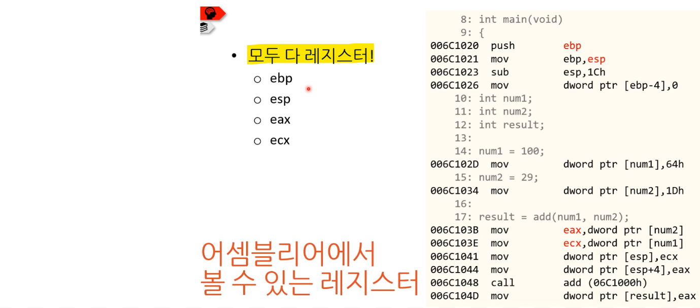
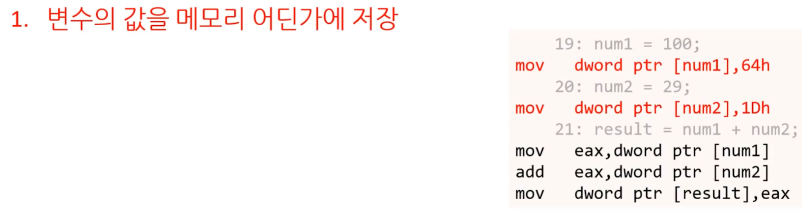
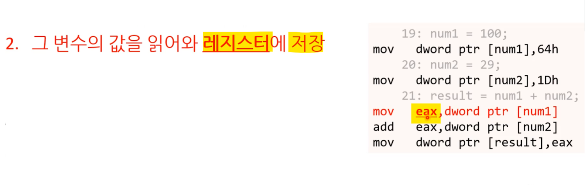
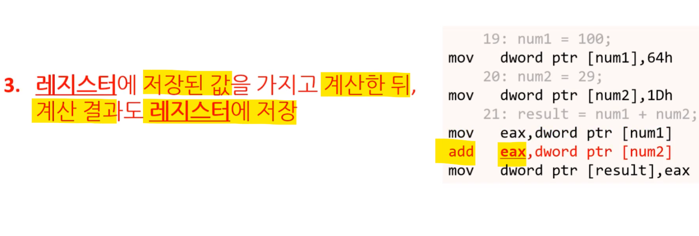
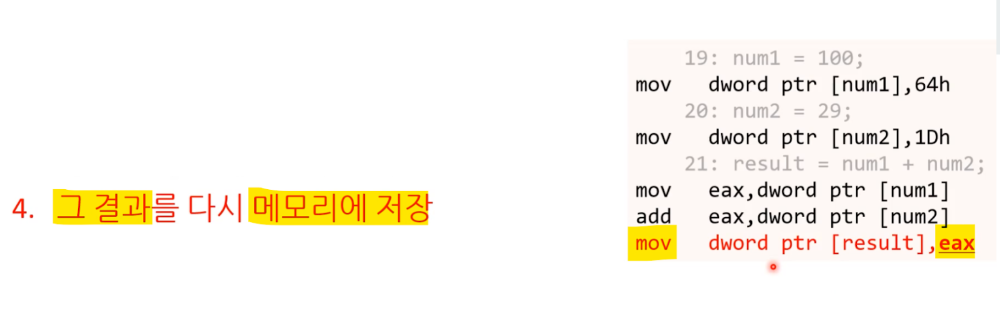
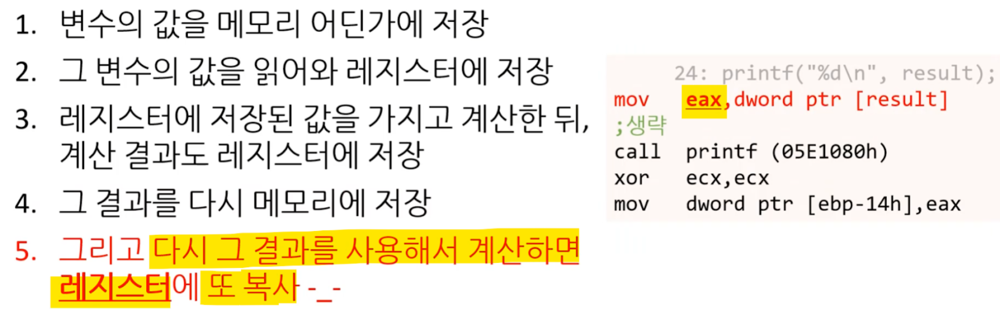

[bluestronica.github.io/C](https://bluestronica.github.io/C)

# 레지스터, 스택 & 힙

### 레지스터(register)
- 레지스터는 CPU가 사용하는 저장 공간 중에 가장 빠른 저장 공간
  - 레지스터는 흔히 말하는 '메모리'가 아니다.
  - CPU가 레지스터에 접근하는 방법과 메모리 접근하는 방벙이 다른 게 보통
- CPU가 연산을 할 때 보통 레지스터에 저장되어 있는 데이터를 사용
- 그 연산결과도 레지스터에 다시 저장하는 게 보통

### x86 아키텍쳐에서 사용하는 레지스터
- 8개의 범용 레지스터
  - ESP, EBP, EAX, EBX, ECX, EDX 등등
- 6개의 세그먼트 레지스터
- 1개의 플래그 레지스터
- 1개의 명령 포인터
- 등등

### 스택 메모리의 단점 - 수명
- 함수가 반환하면 그 안에 있던 데이터가 다 날아감
  - 즉, 함수 안에 있는 변수의 수명(lifecycle)은 함수가 끝날 때까지
- 그렇지 않고 데이터를 오래 보존하려면 전역 변수, static 키워드를 사용해야 한다.
  - 이런 변수의 수명은 프로그램 실행 내내

### 스택 메모리의 단점 - 크기
- 스택 메모리는 특정 용도에 쓰라고 별도로 떼어 놓은 메모리다
- 그 크기는 컴파일 시에 결정하므로 너무 크게 못 잡는다.
- 프로그램 실행할 시 시스템의 메모리가 1MB일 수도 있고 4GB일 수도 있다.
- 그래서 엄청 큰 데이터를 처리해야 할 경우 스택 메모리에 못 넣는다.
  - 4K로 녹화해서 파일 크기가 2GB인 동영상 파일

### 힙 메모리
- 컴퓨터에 존재하는 범용적 메모리
- 스택 메모리처럼 특정 용도로 떼어 놓은 게 아님
- 스택과 달리 컴파일러 및 CPU가 자동적으로 메모리 관리를 안해준다.
- 따라서 프로그래머가 원하는 때 원하는 만큼 메모리를 할당받아와 사용하고 원할 때 반납(해제)할 수 있다.

### 힙 메모리의 장점
- 용량 제한이 없다.
- 프로그래머가 데이터의 수명을 직접 제어

### 힙 메모리의 단점
- 빌려온 메모리를 직접 해제 안하면 누구도 그 메모리를 쓸 수 없다.
  - 그래서 메모리 누수가 발생한다.
- 스택에 비해 할당과 해제 속도가 느리다.
  - 스택은 오프셋 개념이고 힙은 사용/비사용 중인 메모리 관리 개념
  - 메모리 공간에 구멍이 생겨 효율적으로 메모리 관리가 어렵기도 함
  - 함수가 요청한 크기만큼의 빈 공간을 찾으려고 이리저리 뒤져야 함
  
### 정적 메모리 vs 동적 메모리
- 스택 메모리는 정적 메모리
  - 이미 공간이 따로 잡혀 있음
  - 할당/해제가 자동으로 관리되게 코드가 컴파일됨
  - 오프셋 개념으로 정확히 몇 바이트씩 사용해야 하는지 컴파일시 결정
- 힙 메모리는 동적 메모리
  - 실행 중에 크기와 할당/해제 시기가 결정됨
  

