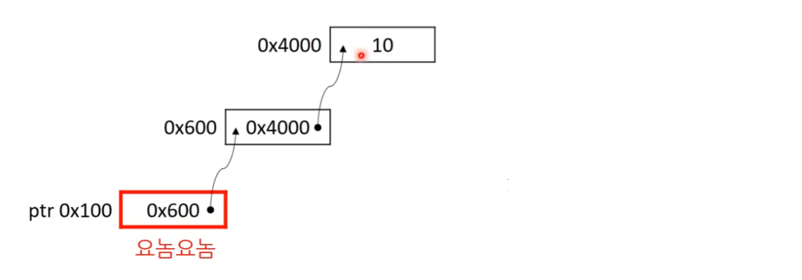

[bluestronica.github.io/C](https://bluestronica.github.io/C)


# 동적 메모리

### 프로그램이 동적 메모리를 가져다 사용할 때는 총 세 가지 단계를 거친다.
- 메모리 할당
- 메모리 사용
- 메모리 해제

### 메모리 할당 함수: malloc()
- ` void* malloc(size_t size); `
- 메모리 할당(memory allocation)의 약자
- size 바이트 만큼 메모리를 반환해줌
- 초기화를 안 해주기때문에 반환된 메모리에 들어있는 값은 쓰레기 값
- 메모리가 더 이상 없다거나 해서 실패하면 NULL 반환

### malloc()의 짝꿍 함수 free()
- 메모리를 빌렸으면 메모리를 반납해야 함
- **고로 malloc() 코드를 작성하면 곧바로 free() 코드도 추가하는 습관을 들이는게 좋음**
- malloc()한 뒤 free() 까먹으면 메모리 누수 발생 
- 그래서 malloc()과 free()는 한 몸이다!!!

### 할당받은 메모리를 해제: free()
- ` void free(void* ptr); `
- 할당받은 메모리를 해제하는 함수
- 즉, 메모리 할당 함수들을 통해서 얻은 메모리만 해제 가능
- 그 외의 주소를 매개변수로 전달할 경우 결과가 정의되지 않음

### 할당받아 온 주소를 그대로 연산에 사용하면?
```c
int* nums;

nums = malloc(LENGTH * sizeof(int));

for (i = 0; i < LENGTH; ++i)
{
  *nums++ = 10 * (i + 1);  // 할당받은 포인터로 연산 금지
  // 반환된 주소를 가지고 있는 변수를 그대로 포인터 연산에 사용하면 
  // 메모리 해제할 때 문제가 발생할 수도 있음
  // 최초에 받아온 주소가 아니라 다른 위치를 가리키게 된다.
  // 그 주소로 메모리 해제 요청하면 엉뚱한 주소를 해제하게 된다.
}

free(nums);  // 엉뚱한 주소를 해제
```

### 할당받은 포인터로 연산 금지!
```c
void* nums;
int* p;
size_ i;

nums = malloc(LENGTH * sizeof(int));
p = nums;     // 메모리 할당 함수에서 받아온 포인터와 
              // 포인터 연산에 사용하는 포인터를 분리하자

for (i = 0; i < LENGTH; ++i)
{
  *p++ = 10 * (i + 1);
}

free(nums);
```

### 메모리 해제 후 널 포인터를 대입
- free()한 뒤에 변수에 NULL을 대입해서 초기화
  - 안 그러면 해제된 놈인지 나중에 모르니
  - 널 포인터를 free()의 매개변수로 전달해도 안전
```c
void* nums;
int* p;
size_ i;

nums = malloc(LENGTH * sizeof(int));
p = nums; 

// 코드 생략

free(nums);
nums = NULL;    // 해제 후 NULL 대입해서 초기화
```

### free()는 몇 바이트를 해제할 지 어떻게 알까?
- 구현마다 다르지만 보통 malloc(32)하면 그것보다 조금 큰 메모리를 할당한 뒤, 제일 앞부분에 어떤 데이터들 채워 놓음
  - `| ... | 어떤 데이터 | 32바이트짜리 메모리 | ... |`
- 그리고 그만큼 오프셋을 더한 값을 주소로 돌려줌
  - 만약 '어떤 데이터'의 크기가 4바이트면 0x100에 4만큼 더한 0x104를 돌려줌
- 나중에 그 주소를 해제 요청하면 free()가 다시 오스펫만큼 빼서 그 앞 주소를 본 뒤, 실제 몇 바이트가 할당됐는지 확인('어떤 데이터' 내용을 확인) 후 해제 

### 메모리 할당 함수: calloc()
- `void* calloc(size_t num, size_t size);`
- 메모리르 할당할 때 자료형의 크기(size)와 수(num)를 따로 지정
- 모든 바이트를 0으로 초기화 해 줌
- 잘 안 씀
- **calloc() 대신 malloc() + memset()를 조합해서 쓴다.**
  - memset()을 쓰면 0 외의 값으로도 초기화 가능

### 메모리 할당 초기화 함수: memset()
- `void* memset(void* dest, int ch, size_t count);`
  - dest는 메모리 시작 위치, count는 메모리 총 바이트, ch는 초기화할 값 
- 무조건 char로 초기화(1바이트 씩)됨
```c
void* nums;

nums = malloc(LENGTH * sizeof(int));
memset(nums, 1000, LENGTH * sizeof(int));  // 1000의 값은 16진수로 0x3E8

free(nums);
nums = NULL:

// ch의 값(1000)이 1바이트를 넘어 선다. 
// 그래서 03은 날아가고 E8 값으로 초기화 된다.
```
- 그 외의 자료형으로 초기화하려면 직접 for 문을 써야함
```c
void* nums;
int* p;
size_t i;

nums = malloc(LENGTH * sizeof(int));
p = nums;

for (i = 0; i < LENGTH; ++i)
{
  *p++ = 1000;   // (int)4바이트 씩 초기화 값 03E800 들어간다.
}

free(nums);
nums = NULL;
```
- 다름 과 같은 경우 결과가 정의되지 않는다.
  - count가 dest의 영역을 넘어설 경우(소유하지 않은 메모리에 쓰기)
  - dest가 널 포인터일 경우(널 포인터 역참조)

### 메모리 재할당 함수: realloc()
- **`void* realloc(void* ptr, size_t new_size);`**
- 이미 존재하는 메모리(ptr)의 크기를 new_size 바이트로 변경
- 새로운 크기가 허용하는 한 기존 데이트를 그대로 유지
- 반환값
  - 성공 시, 새롭게 할당된 메모리의 시작 주소를 반환하며 기본 메모리는 해제됨
  - 실패 시, NULL을 반환하지만 기본 메모리는 해제되지 않는다. 메모리 누수 발생!!
- 올바른 재할당 방법
```c
void * nums;
void* tmp;

// LENGTH: 4, nums: 10
nums = malloc(LENGTH);;

tmp = realloc(nums, 2 * LENGTH);
if (tmp != nULL)
{
  nums = tmp;
}

free(nums);
```
- realloc()은 malloc() + momcpy() + free()와 유사함
```c
void * nums;
void* tmp;

// LENGTH: 4, nums: 10
nums = malloc(LENGTH);;

tmp = malloc(2 * LENGTH);
if (tmp != nULL)
{
  memcpy(tmp, nums, LENGTH);
  free(nums);
  nums = tmp;
}

free(nums);
```

### 메모리 복사 함수: memcpy()
- **`void* memcpy(void* dest, const void* src, size_t count);`**
- src의 데이터를 count 바이트 만큼 dest에 복사
- 다음과 같은 경우 결과가 정의되지 않음
  - dest의 영역 뒤에 데이터를 복사할 경우 (소유하지 않은 메모리에 쓰기)
  - src나 dest가 널 포인터일 경우 (널 포인터 역참조)


### 메모리 누수 안 나게 코드를 작성할 것!
- realloc()을 쓸 때는 정말 정말 조심해야 함
- 그래서 차라리 mallock() + memcpy() + free()로 좀더 명시적으로 드러나게 코딩하는 게 나을지도
- 그냥 신경 안 쓰고 realloc()을 쓰는 경우도 많음
  - 메모리 시작 주소가 변하지 않는 경우 데이터 복사를 하지 않아 성능상 이득
  - 그리고 메모리가 없어서 널 포인터를 반환하는 상황에 어떻게 대처할것인가?
  - malloc()에서 실패하는 일이 없다고 가정하고 코딩하는 경우가 많은 이유도 마찬가지
  
### realloc()의 특수한 경우
- **` nums = realloc(NULL, LENGTH); `**
- 새로운 메모리 할당
- **`malloc(LENGTH)`** 와 동일

### 메모리 비교하는 함수: memcmp()
- **` int memcmp(const void* lhs, const void* rhs, size_t count); `**
- 첫 count 바이트 만큼의 메모리를 비교하는 함수
- strcmp()와 매우 비슷
- 단, 널 문자를 만나도 계속 진행
- 다음의 경우 결과가 정의되지 않음
  - lhs과 rhs의 크기를 넘어서서 비교할 경우 (소유하지 않은 메모리에 쓰기)
  - lhs이나 rhs이 널 포인터일 경우 (널 포인터 역참조)


### 구조체 두 개를 비교할 때 유용
```c
typedef struct 
{
  char firstname[64];
  char lastname[64];
  unsigned int id;
} student_t;

student_t s1 = { "Lulu", "Kim", 12345 };
student_t s2 = { "Teemo", "Park", 12349 };
student_t s3 = { "Lulu", "Choi", 12350 };
student_t s4 = { "Teemo", "Park", 12340 };

int reuslt;

result = memcmp(&s1, &s2, sizeof(student_t));  // -1 , L < T
result = memcmp(&s1, &s3, sizeof(student_t));  // 1 , K > C
result = memcmp(&s2, &s4, sizeof(student_t));  // 1 , 9 > 0

```
- 단, 구조체가 포인터 변수를 가질 경우에는 값이 같아도 주소가 달라 다룰 수 있음


### 구조체 멤버 변수 - 배열 vs 포인터
- 고정된 길이인 배열
```c
typedef struct 
{
  char firstname[NAME_LEN];
  char lastname[NAME_LEN];

} name_fixed_t;
```
  - 그대로 대입 가능
  - 파일에 곧바로 저장 가능
  - memcpy()를 곧바로 사용 가능
  - 낭비하는 용량이 있음
  - 메모리 할당/해제 속도 빠름
- 동적 메모리를 사용하는 포인터
```c
typedef struct
{
  char* firstname;
  char* lastname;
} name_dynamic_t;
```
  - 그대로 대입 불가
    - 이 경우는 얕은 복사가 되어버림
  - 파일에 곧바로 저장 불가능
  - memcpy() 곧바로 사용 불가
  - 낭비하는 용량 없음
  - 메모리 할당/해제 속도 느림
- 실제 크기를 어느 정도로 제한할 수 있으면 배열 방식을 더 많이 쓴다.
- 헐씬 빠른 방법이기때문에
- 그래서 정적 메모리를 우선적으로 사용할 것
- 안 될 때만 동적 메모리 사용 

### 정리
- malloc() 작성한 뒤에 곧바로 free()도 추가하자
  - free()를 절대 까먹으면 안 됨!!
- 동적 할당을 한 메모리 주소를 저장하는 포인터 변수와 포인터 연산에 사용하는 포인터 변수를 분리해 사용하자
  - 원래 포인터 변수를 사용할 경우, 주소를 잃어버려서 해제를 못할 수 있음
- 메모리 해제 후, 널 포인터 대입하자
- 정적 메모리를 우선 사용하고 어쩔 수 없을 때만 동적 메모리를 사용하자.
- 동적 메모리 할당을 할 경우, 변수와 함수 일므에 그 사실을 알리자
   - 함수 안에서 할당을 반환하는 패터이 없으면 없을 수록 좋은거다.
```c
const char* combine_string_malloc(const char* str1, const char* str2)
{
  void* pa_str;
  char* p;
  
  pa_str = malloc(size);
  p = pa_str;
  
  // 문자를 합치는 코드
  
  return pa_str;
}
```

# 다중 포인터
```c
int num = 10;
int* p = &num;
int** pp = &p;   // (int*)* => int 포인터를 저장하는 포인터
```
- 포인터 변수의 주소를 저장하는 변수를 이중 포인터라고 한다.


### 이중 포인터 사용
- 2차원 배열은 이중 포인터와 비슷!
- 메인 함수의 매개변수에도 있다
  - **` int main(int argc, char* argv[]); `**
  - **` int main(int argc, char** argv); `**
- 2차원 공간을 다루는 분야에서는 3차원 배열 사용
- 따라서, 역시 삼중 포인터 사용
- 포인터 변수를 서로 교체하기
```c
void swap(int** n1, int** n2)
{
  int* tmp = *n1;
  
  *n1 = *n2;
  *n2 = tmp;
}

int num1 = 10;
int num2 = 20;

int* p;
int* q;

p = &num1;
q = &num2;

swap(&p, &q);
```


