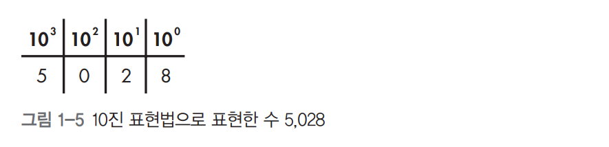
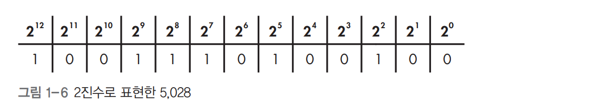
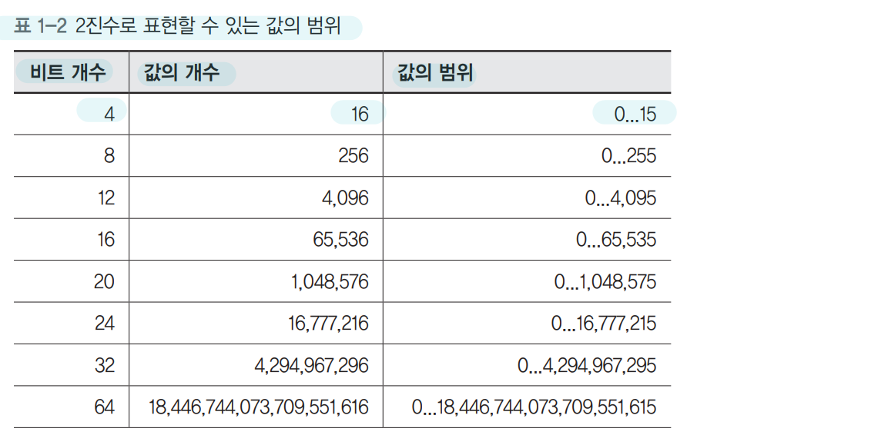
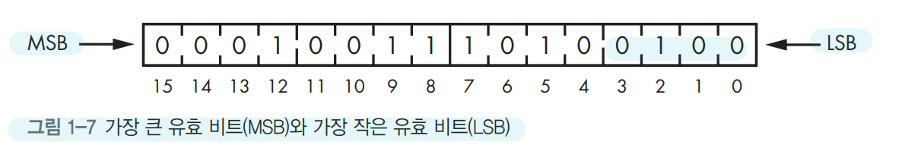

## 1장. 컴퓨터 내부의 언어 체계

### 비트
- 컴퓨터 언어의 세 가지 구성요소
  - 기호가 들어갈 상자
    - 자연어에서는 이 상자를 문자(character)라고 부르며, 컴퓨터에서는 비트(bit)라고 부른다.
    - 비트라는 단어는 2진법을 사용한다는 뜻의 바이너리(binary)와 숫자를 뜻하는 디지트(digit)가 기묘하게 합쳐진 말이다.
  - 상자에 들어갈 기호
    - 비트 상자에는 두 가지 기호 중 하나만을 담을 수 있다는 뜻이다.
    - 기호라는 개념은 추상적이다, 실제로 기호가 무엇이든 관계없다. 따라서 표준적인 비트 사용법을 배우더라도, 자신에게 적합한 자신만의 비트 사용법을 새로 만들어내는 것을 두려워할 필요가 없다.
  - 상자의 순서

### 논리 연산
다른 비트들이 표현하는 내용으로부터 -> 새로운 비트를 만들어 내는 이런 동작을 논리 연산이라고 한다.
- 불리언 대수
  -  비트에 대해 사용할 수 있는 연산 규칙의 집합이다. 결합법칙, 교환법칙, 분배법칙을 적용할 수 있다.
  - NOT
    - 논리적 반대를 의미한다. 입력의 상태를 반대로 반전시킨다.
    - 거짓인 비트는 참이 되고 참인 비트는 거짓이 된다.
  - AND
    - 첫 번째 비트가 참, 두 번째 비트가 참 -> 결과가 참이 된다.
    - 두 입력이 모두 참이면 결과도 참이다.
  - OR
    - 어느 한 비트라도 참이면 결과도 참이다.
  - XOR
    - 두 입력이 다른 값인 경우에만 참이 된다.
- 드모르간의 법칙
  - a AND b == NOT(NOT a OR NOT b)
  - 즉, NOT을 충분히 사용하면 AND 연산을 OR 연산으로 대신할 수 있다.
  - 역으로 OR을 AND로 대신할 수 있다.
 
### 정수를 비트로 표현하는 방법
- 양의 정수 표현
  - 10진수 체계에서는 10가지 기호인 숫자(digit)를 상자에 담을 수 있다.
  - 오른쪽에서 왼쪽으로 상자가 쌓여가며, 맨 오른쪽에 있는 상자에는 일의 자리, 오른쪽에서 두 번째 상자에는 십의 자리, 세 번째 상자는 백의 자리라는 이름이 붙는다.
  - 각 이름은 10의 거듭제곱에 해당한다.
  - 10진수로는 5,028이 네 자리 숫자라고 말할 수 있다.
  
  - 2진수로 표현한 5,028
  - 2진수로는 13비트 수가된다.
  
  - 2진수로 표현할 수 있는 값의 범위
  
  - |1|0|0|0|
    - 0과 1을 표현할 수 있는 **상자(비트)의 개수 4개**이며 **4비트**가 된다.
    - 같은 사건 연속이므로 `2*2*2*2`가 된다.
    - 그래서 나타낼 수 있는 **값의 개수는 16개**가 된다.
    - **값의 범위는 0부터 15까지**가 된다.
  - 5,028을 16비트 2진수로 저장한 모습
   
  - 2진수 덧셈
    - 각 비트를 LSB에서 MSB 쪽으로 더하며 결과가 1보다 크면 1을 다음 자리(왼쪽)으로 올린다.
    - 덧셈 결과가 우리가 사용할 비트의 개수로 표현할 수 있는 범위를 벗어나면 오버플로(overflow)가 발생한다.
    - 오버플로란 말은 MSB에서 올림이 발생했다는 뜻이다.
- 음수 표현
  - 부호와 크기
    - 음수와 양수를 구별하기 위해 흔히 부호(sign)를 사용한다.
    - 양부호(+)와 음부호(-)
    - 가장 왼쪽비트(MSB)를 부호를 나타내는 비트로 사용한다.
    - 4비트 중에 3비트가 남아 0부터 7까지 수를 표현할 수 있다.
    - 그리고 부호 비트가 0이면 양수, 부호 비트가 1이면 음수
    - 그래서 총 15가지 음수와 양수를 표현할 수 있다.
    - 양수 0과 음수 0은 똑같은 0이기 때문에 표현할 수 있는 수의 가짓수가 16가지가 아니라는 점에 유의한다.
    - 2진수 부호와 크기 표현법

      |부호|4|2|1|10진수|
      |---:|:---|:---|:---|:---|
      |0|1|1|1|+7|
      |0|1|1|0|+6|
      |0|1|0|1|+5|
      |0|1|0|0|+4|
      |0|0|1|1|+3|
      |0|0|1|0|+2|
      |0|0|0|1|+1|
      |0|0|0|0|+0|
      |1|0|0|0|-0|
      |1|0|0|1|-1|
      |1|0|1|0|-2|
      |1|0|1|1|-3|
      |1|1|0|0|-4|
      |1|1|0|1|-5|
      |1|1|1|0|-6|
      |1|1|1|1|-7|
    - **부호와 크기 표현법은 두 가지 이유로 인해 널리 쓰이지 못하고 있다.**
      - 비트들을 구성하려면 비용이 드는데 0을 표현하는 방법이 두 가지라서 비용이 낭비된다.
      - 부호와 크기 표현법을 사용하면 XOR과 AND를 통한 덧셈 계산을 사용할 수 없다.
        - +1(0001) + -1(1001) = -2(1010)이 된다. 
  - **1의 보수**
    - 음수를 표현하는 또 다른 방법으로는 양수의 모든 비트를 뒤집는 방법이 있다.
    - 1의 보수 표현법이라고 부른다.
      |부호|4|2|1|10진수|
      |---:|:---|:---|:---|:---|
      |0|1|1|1|+7|
      |0|1|1|0|+6|
      |0|1|0|1|+5|
      |0|1|0|0|+4|
      |0|0|1|1|+3|
      |0|0|1|0|+2|
      |0|0|0|1|+1|
      |0|0|0|0|+0|
      |1|1|1|1|-0|
      |1|1|1|0|-1|
      |1|1|0|1|-2|
      |1|1|0|0|-3|
      |1|0|1|1|-4|
      |1|0|1|0|-5|
      |1|0|0|1|-6|
      |1|0|0|0|-7|
    - 0111(+7)의 각 비트를 뒤집으면 1000(-7)을 얻을 수 있음을 알 수 있다.
      - 1의 보수 표현법을 적용하면 **`0 -> 1`, `1 -> 0`으로 역할이 바뀐다.**

