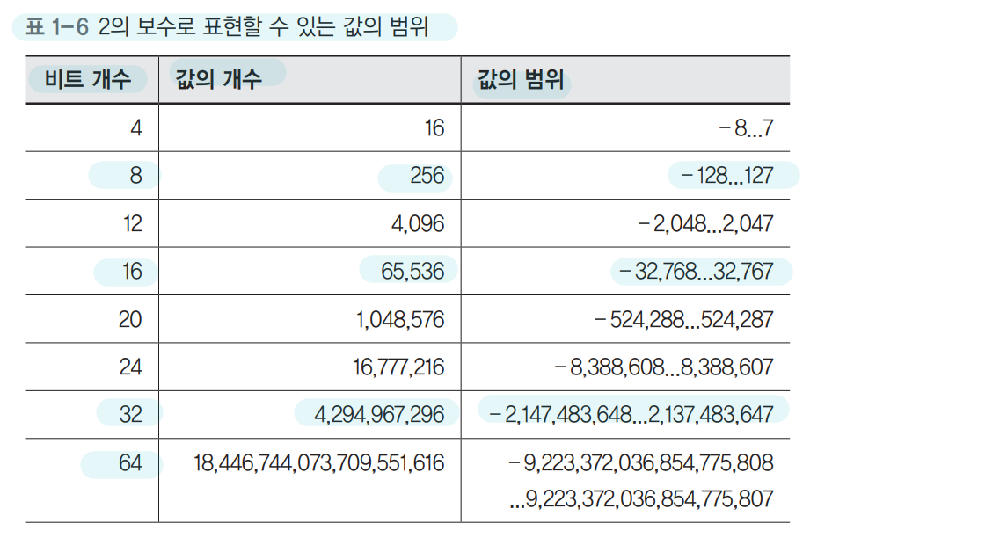
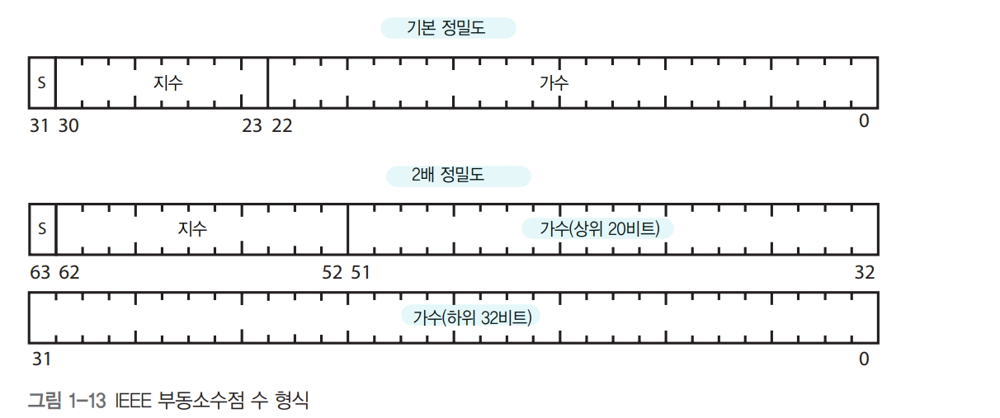
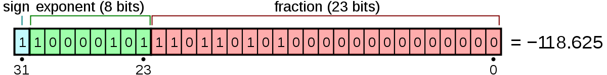

## 1장. 컴퓨터 내부의 언어 체계

### 비트
- 컴퓨터 언어의 세 가지 구성요소
  - 기호가 들어갈 상자
    - 자연어에서는 이 상자를 문자(character)라고 부르며, 컴퓨터에서는 비트(bit)라고 부른다.
    - 비트라는 단어는 2진법을 사용한다는 뜻의 바이너리(binary)와 숫자를 뜻하는 디지트(digit)가 기묘하게 합쳐진 말이다.
  - 상자에 들어갈 기호
    - 비트 상자에는 두 가지 기호 중 하나만을 담을 수 있다는 뜻이다.
    - 기호라는 개념은 추상적이다, 실제로 기호가 무엇이든 관계없다. 따라서 표준적인 비트 사용법을 배우더라도, 자신에게 적합한 자신만의 비트 사용법을 새로 만들어내는 것을 두려워할 필요가 없다.
  - 상자의 순서

### 논리 연산
다른 비트들이 표현하는 내용으로부터 -> 새로운 비트를 만들어 내는 이런 동작을 논리 연산이라고 한다.
- 불리언 대수
  -  비트에 대해 사용할 수 있는 연산 규칙의 집합이다. 결합법칙, 교환법칙, 분배법칙을 적용할 수 있다.
  - NOT
    - 논리적 반대를 의미한다. 입력의 상태를 반대로 반전시킨다.
    - 거짓인 비트는 참이 되고 참인 비트는 거짓이 된다.
  - AND
    - 첫 번째 비트가 참, 두 번째 비트가 참 -> 결과가 참이 된다.
    - 두 입력이 모두 참이면 결과도 참이다.
  - OR
    - 어느 한 비트라도 참이면 결과도 참이다.
  - XOR
    - 두 입력이 다른 값인 경우에만 참이 된다.
- 드모르간의 법칙
  - a AND b == NOT(NOT a OR NOT b)
  - 즉, NOT을 충분히 사용하면 AND 연산을 OR 연산으로 대신할 수 있다.
  - 역으로 OR을 AND로 대신할 수 있다.
 
### 정수를 비트로 표현하는 방법
- **양의 정수 표현**
  - 10진수 체계에서는 10가지 기호인 숫자(digit)를 상자에 담을 수 있다.
  - 오른쪽에서 왼쪽으로 상자가 쌓여가며, 맨 오른쪽에 있는 상자에는 일의 자리, 오른쪽에서 두 번째 상자에는 십의 자리, 세 번째 상자는 백의 자리라는 이름이 붙는다.
  - 각 이름은 10의 거듭제곱에 해당한다.
  - 10진수로는 5,028이 네 자리 숫자라고 말할 수 있다.
  
  - 2진수로 표현한 5,028
  - 2진수로는 13비트 수가된다.
  
  - 2진수로 표현할 수 있는 값의 범위
  
  - |1|0|0|0|
    - 0과 1을 표현할 수 있는 **상자(비트)의 개수 4개**이며 **4비트**가 된다.
    - 같은 사건 연속이므로 `2*2*2*2`가 된다.
    - 그래서 나타낼 수 있는 **값의 개수는 16개**가 된다.
    - **값의 범위는 0부터 15까지**가 된다.
  - 5,028을 16비트 2진수로 저장한 모습
   
  - **2진수 덧셈**
    - 각 비트를 LSB에서 MSB 쪽으로 더하며 결과가 1보다 크면 1을 다음 자리(왼쪽)으로 올린다.
    - 덧셈 결과가 우리가 사용할 비트의 개수로 표현할 수 있는 범위를 벗어나면 오버플로(overflow)가 발생한다.
    - 오버플로란 말은 MSB에서 올림이 발생했다는 뜻이다.
- **음의 정수 표현**
  - 부호와 크기
    - 음수와 양수를 구별하기 위해 흔히 부호(sign)를 사용한다.
    - 양부호(+)와 음부호(-)
    - 가장 왼쪽비트(MSB)를 부호를 나타내는 비트로 사용한다.
    - 4비트 중에 3비트가 남아 0부터 7까지 수를 표현할 수 있다.
    - 그리고 부호 비트가 0이면 양수, 부호 비트가 1이면 음수
    - 그래서 총 15가지 음수와 양수를 표현할 수 있다.
    - 양수 0과 음수 0은 똑같은 0이기 때문에 표현할 수 있는 수의 가짓수가 16가지가 아니라는 점에 유의한다.
    - 2진수 부호와 크기 표현법

      |부호|4|2|1|10진수|
      |---:|:---|:---|:---|:---|
      |0|1|1|1|+7|
      |0|1|1|0|+6|
      |0|1|0|1|+5|
      |0|1|0|0|+4|
      |0|0|1|1|+3|
      |0|0|1|0|+2|
      |0|0|0|1|+1|
      |0|0|0|0|+0|
      |1|0|0|0|-0|
      |1|0|0|1|-1|
      |1|0|1|0|-2|
      |1|0|1|1|-3|
      |1|1|0|0|-4|
      |1|1|0|1|-5|
      |1|1|1|0|-6|
      |1|1|1|1|-7|
    - **부호와 크기 표현법은 두 가지 이유로 인해 널리 쓰이지 못하고 있다.**
      - 비트들을 구성하려면 비용이 드는데 0을 표현하는 방법이 두 가지라서 비용이 낭비된다.
      - 부호와 크기 표현법을 사용하면 XOR과 AND를 통한 덧셈 계산을 사용할 수 없다.
        - +1(0001) + -1(1001) = -2(1010)이 된다. 
  - 1의 보수
    - 음수를 표현하는 또 다른 방법으로는 양수의 모든 비트를 뒤집는 방법이 있다.
    - 1의 보수 표현법이라고 부른다.
      |부호|4|2|1|10진수|
      |---:|:---|:---|:---|:---|
      |0|1|1|1|+7|
      |0|1|1|0|+6|
      |0|1|0|1|+5|
      |0|1|0|0|+4|
      |0|0|1|1|+3|
      |0|0|1|0|+2|
      |0|0|0|1|+1|
      |0|0|0|0|+0|
      |1|1|1|1|-0|
      |1|1|1|0|-1|
      |1|1|0|1|-2|
      |1|1|0|0|-3|
      |1|0|1|1|-4|
      |1|0|1|0|-5|
      |1|0|0|1|-6|
      |1|0|0|0|-7|
    - 0111(+7)의 각 비트를 뒤집으면 1000(-7)을 얻을 수 있음을 알 수 있다.
      - 1의 보수 표현법을 적용하면 **`0 -> 1`, `1 -> 0`으로 역할이 바뀐다.**
    - 순환 올림을 처리하기 위한 하드웨어를 추가해야 하기 때문에 그다지 좋은 해법은 아니다.
    - `부호와 크기 표현법`이나 `1의 보수 표현법`을 **모두 사용하지 않는다.**
  - **2의 보수**
    - 이 방법은 부호가 있는 정수를 표현할 때 가장 널리 쓰이는 방법이다.
    - 어떤 수의 비트를 뒤집고(즉 각 비트의 NOT 반전을 취하고) 1을 추가하면 음수를 얻을 수 있다.
    - 이때, MSB에서 올림이 발생하면 이 값을 버린다.
    - +1인 0001을 NOT을 취하면 1110이고, 여기에 1을 더하면 1111이 되며, 이 값이 -1을 표현한다.
    - +1 + -1 = 0
    - 0001 + 1111(0001을 NOT하면 1110 + 1) = `1`0000이 된다. 올림이 발생한 `1`은 버린다.
    - **1의 보수 + 1**
    - 2의 보수 표기
      |부호|4|2|1|10진수|
      |---:|:---|:---|:---|:---|
      |0|1|1|1|+7|
      |0|1|1|0|+6|
      |0|1|0|1|+5|
      |0|1|0|0|+4|
      |0|0|1|1|+3|
      |0|0|1|0|+2|
      |0|0|0|1|+1|
      |0|0|0|0|+0|
      |1|1|1|1|-1|
      |1|1|1|0|-2|
      |1|1|0|1|-3|
      |1|1|0|0|-4|
      |1|0|1|1|-5|
      |1|0|1|0|-6|
      |1|0|0|1|-7|
      |1|0|0|0|-8|
    - 2의 보수에는 `0`의 중복 표현 문제가 없다. 즉 0을 표현하는 방법이 하나뿐이다.
    - 또한, 2의 보수에서는 2진수 `1111`은 `-1`을 나타낸다.
    - 2의 보수로 표현할 수 있는 값의 범위
    - `01234567-1-2-3-4-5-6-7`
      

### 실수를 표현하는 방법
- 정수의 이진수 변환
  - 2로 나누어 몫과 나머지를 구한다.
  - 몫이 0이 될 때까지 몫을 대상으로 과정 1을 반복한다.
  - 처음 구한 나머지가 가자 오른쪽에 오도록 나머지 순서대로 적는다.
  - 35
    - 35/2 = 17...**1**
    - 17/2 = 08...**1**
    - 08/2 = 04...**0**
    - 04/2 = 02...**0**
    - 02/2 = 1....**0**
    - 01/2 = 0....**1**
    - 35 = 100011
- 소수점 이진수 변환
  - 2를 곱하여 정수 부분과 소수 부분을 구한다.
  - 소수 부분이 0이 될 때까지(결과가 1로 떨어질 때까지) 소수 부분을 대상으로 과정 1을 반복한다.
  - 처음 구한 정수 부분이 가장 왼쪽에 오도록 정수 부분을 순서대로 적는다. 
  - 0.8125 : 소수 부분이 0이 될 때까지 
    - 0.8125 * 2 = **1**.625
    - 0.625 * 2 = **1**.25
    - 0.25 * 2 = **0**.5
    - 0.5 *2 = **1**.0
    - 0.8125 = 0.1101
  - 125.3 : 똑같은 소수점이 나올 때까지
    - 0.3 * 2 = **0**.6
    - 0.6 * 2 = **1**.2
    - 0.2*2 = **0**.4
    - 0.4 * 2 = **0**.8
    - 0.8 * 2 = **1**.6 (첫번째 결과의 소수점과 동일하므로 중단)
    - 01001
- 고정소수점 표현법
  - 2진수를 사용해 소수를 표현하기 위해 **2진 소수점의 위치를 임의로 정하는 방법**이다.
  - 소수점의 위치가 항상 일정하기 때문에 이런 방식을 고정소수점 표현법이라한다.
  - 소수점의 위치가 고정되어 있어 **수의 표현범위가 제한되어 있는 표현 방식**이다.
  - 10진수의 소수(분수)표현은 1/10, 1/100 등 10의 거듭제곱을 분모로 사용한다.
  - 2진수의 소수(분수)표현은 1/2, 1/4 등 2의 거듭제곱을 분모로 사용한다.
  - 플랑크 상수부터 아보가드로 수에 이르는 범위 값을 비트로 표현하기에 너무 많은 비트 개수가 든다.
- 부동소수점 표현법
  - 이를 해결하기 위해, 과학적 표기법을 2진수에 적용한다.
  - 0.0012 대신 1.2 x 0.001으로 표현한다.
    - 가수 부분은 2진 소수 (1.2)
    - 지수 부분은 2의 거듭제곱 횟수를 표현 (0.001)
- IEEE 부동소수점 수 표준
  
- **IEEE 754**
  - IEEE 754의 부동소수점 표현은 최상위 비트는 부호를 표시하는데 사용되며, 지수(exponent) 부분과 가수(fraction/mantissa) 부분이 있다.
  - `-118.625(십진법)`를 IEEE 754(32비트 단정밀도)로 표현해 보자
    - 음수이므로, 부호는 1이 된다.
    - 그 다음, 절댓값(118.625)을 이진법으로 나타내면 1110110.101이 된다.
    - 정규화된 부동소수점을 만든다.
      - 소수점을 왼쪽으로 이동시켜, 왼쪽에는 1만 남게 만든다.
      - 이동시킨 소수점의 자릿수(6) 만큼을 2의 지수로 곱해준다.
      - 1110110.101 = 1.110110101 × 2⁶
    - 가수부(23bit)는 소수점의 오른쪽(110110101) 부분으로, 부족한 비트 수 부분만큼 0으로 채워 23비트로 만든다.
      - 11011010100000000000000 이 된다.
    - 지수는 32bit IEEE764 형식이므로 Bias의 고정된 값은 127이며, bias를 2의 지수인 6을 더하고 이진수로 변환한다.
      - 지수부는  8bit로 구성되어 있고 최소값은 -126이고 최대값은 127을 갖는다.
      - 8bit로 표현 가능한 값은 0~255이기 때문에 이를 반으로 나누어 양수와 음수를 표현하는 것이다.
      - bias + q = 지수부(exponent)가 된다.
    - 6 + 127 = 133 = 10000101(8bit 지수부)

https://nybounce.wordpress.com/2016/06/24/ieee-754-floating-point

