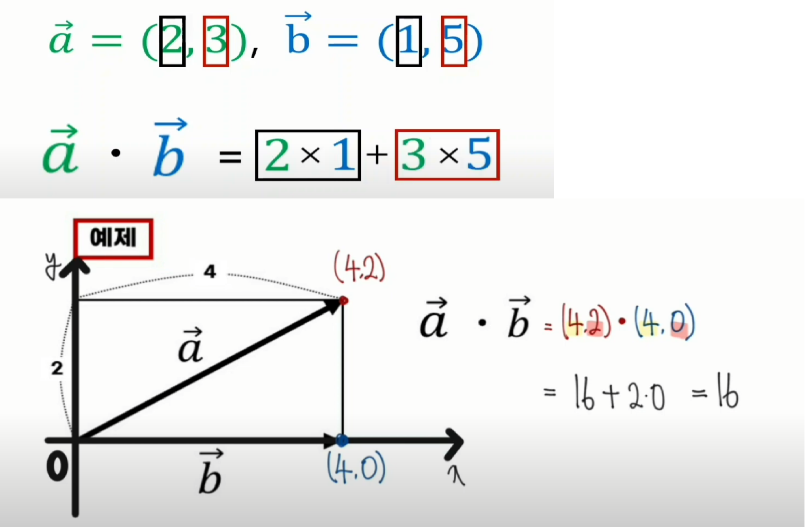

## 벡터(vector)

### 벡터란
- 크기, 방향을 가진 수학적 대상

### 백터가 같다.
- 크기가 같고, 방향이 같다.
- 위치는 상관없다.

## 백터의 덧셈

### 벡터의 뺄셈

### 백터의 성분표현

### 벡터의 내적  

- 내적 공식 

- 내적의 기하학적 의미
  - **예각**
    - 한 벡터의 종점에서 수선의 발 H를 내린 후
    - 다른 벡터의 시점에서 Hㄴ까지의 거리와
    - 다른 벡터의 크기를 곱하면 된다.
   
  
  
  - **둔각**
    -(마이너스)를 붙이면 된다!

 

  - **직각**

  

- 성분으로 계산하기 

  

- 정리

### 벡터의 외적

### 2차원 면 상의 벡터를 단위 벡터를 이용해 표기하기

