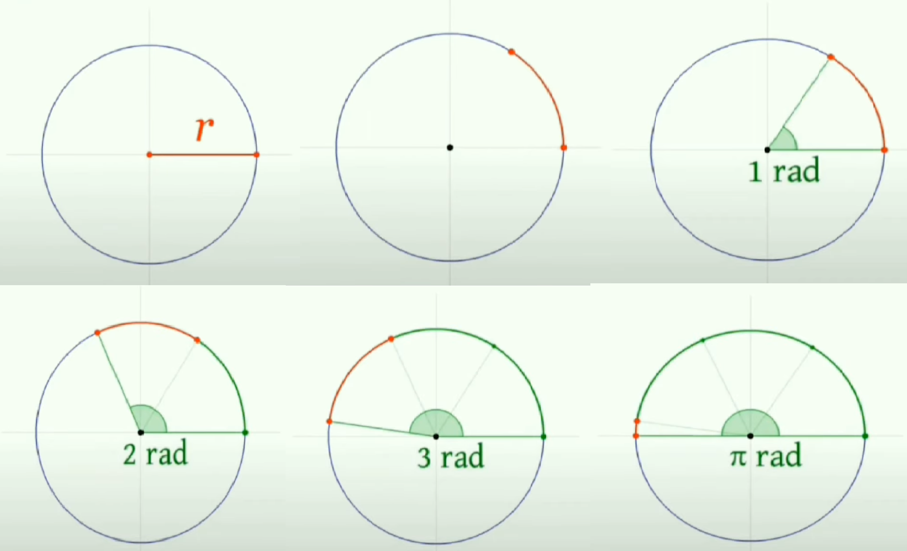
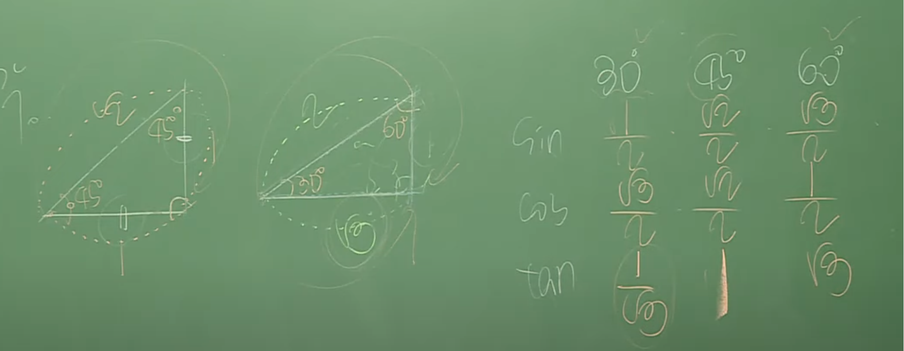
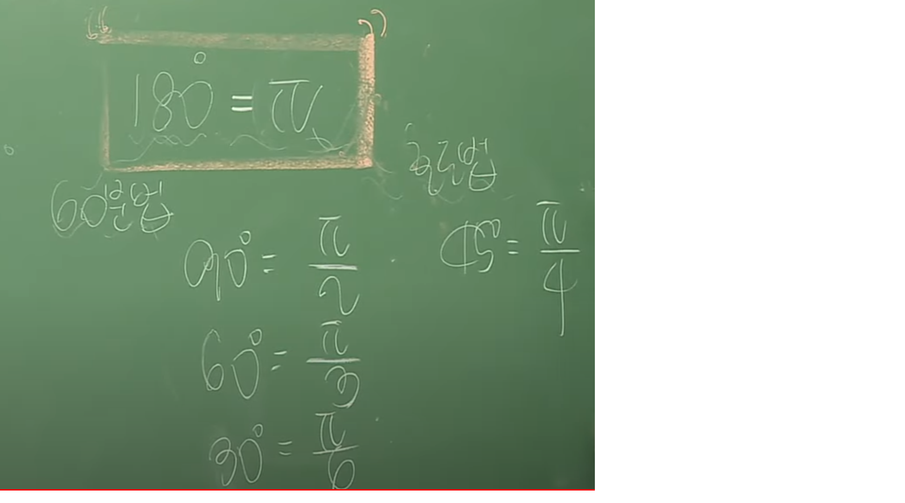

## 라디안과 삼각함수


### π 원주율
- π 는 원의 전체 둘레 길이 / 지름(2r), 원의 크기와 관계없이 그 비율값은 항상 3.14를 가진다.

- π 지름(2r)과 원의 전체 둘레 길이의 비율이라고 말한다.

- 2πr = 원의 전체 둘레 길이


### 라디안(Radian)
- 각도법은 degree 호도법은 radian이라고 한다.

- 호도법은 호의 길이를 이용하여 각도를 재는 방법을 말한다.

- 반지름과 원의 둘레간(호의 길이)의 비율

- 호의 길이가 반지름과 같게 되는 만큼의 각을 1 라디안이라고 정의한다.

- 라디안은 호의 길이와 각도를 구하기 편리하다.

- 컴퓨터나 수학에서 사용하는 각 체계는 라디안이다.





```C++
//1radian은 180을 π로 나눈 값 

π radian = 180degree
1radian = 180/ π degree = 57degree
x radian = x * 180/ π degree = x * 57degree


//1degree은 π를 180으로 나눈 값

180degree = π radian
1degree = π / 180radian
x degree = x * π / 180radian
```

### 삼각비
- 직각 삼각형
  - 예각의 합이 90
  - 직각을 마주보는 변(선)을 빗변
  - 두  개의 예각 중에서 하나의 값을 θ세타(각)라 놓으면 θ세타에 대한 밑변이 된다.
- 직각 삼각형의 변 3개 중에서 어느 두 변의 길이의 비를 **삼각비**라 한다.
- 그 중에서 중요한 삼각비는 sin, cos, tan
  - 이과에서 미적분 과목에서 배우는 안중요한 삼각비 csc, sec, cot
- sinθ
  - θ에서 시작(출발)한다.
  - θ에서 직각을 향해 가는데 고개 너머 돌아가는 방향 그 느낌
- cosθ
  - co(코)가 붙으면 특이하다.
  - θ에서 출발하지 않는다.
  - θ를 사이에 둔다는 그 느낌 그리고 중요한 건 빗변에서 출발한다는 것이다.
  - 빗변에서 출발해서 θ를 사이에 둔다는 그 느낌
- tanθ
  - θ에서 직각을 향해 가장 빠른길로 간다는 그 느낌
  - 그래서 빛변을 나타내는 직선의 기울기가 바로 탄젠트가 된다.
  - tanθ = sinθ / cosθ (중요)
    - 코싸인 분의 싸인은 탄젠트다.
    - 코부네싸
- 특수각
  - 0도, 30도, 45도, 60도, 90도
  - 특수각에 관련된 직각 삼각형은 단 2개 뿐이다.
    - 직각 이등변 삼각형
      - 성질은 밑각이 서로 같다.(45도)
      - 피타고라스 정리
      - 1 : 1 : √2
    -  369 삼각형
      - 30도 60도 90도 이루어져 있다.
      -  1 : √3 : 2




### 호도법
- 각을 실수로 표현하는 방법
- 반지름의 길이랑 호의 길이랑 똑같이 되도록 만드는 각을 **1**, 대략 57.0도 정도 된다.
- 그래서 57.0도를 **1** 이라 부른다.
- 호의 길이가 반지름의 2배일 때 각을 **2**
- 호의 길이가 반지름 3배일 때 각을 **3**
- 각이 3.141592...(pi) 일 때 180도에 이르게 된다.
- 180도 각도를 숫자로 바꾸면 3.141592... pi
- 180도 = pi = 호도법
  - 1호도, 1라디안 이라 불러도도 되지만 잘 쓰지 않는다.. 그냥 **1**이라고 표현한다.
  - 그냥 180도 = pi
  - 양변을 2로 나누면 90 = pi / 2
  - 양변을 3으로 나누면 60 = pi / 3
  - 양변을 4으로 나누면 45 = pi / 4
- 즉, pi에서 호의 길이가 원의 절반 = 180도를 가지고 각도를 산정하는 방법



- 특수각이 아닌 42도를 실수로 나타내고 싶으면 
  - 42도를 무조건 180으로 나눈다. 그리고 다시 pi를 곱한다. 원상복구된다. 
  - 같은 값을 나누고 곱했으니 원상복귀 (180도 = pi)
  - 이것이 바로 일번적인 각도 60분법으로 표현된 각도(42도)를
  - 실수 호적법으로 바꾸는 방법이다.


### 삼각함수의 정의


### 삼각함수의 공식

### 삼각함수의 그래프


### 삼각형과 삼각함수


