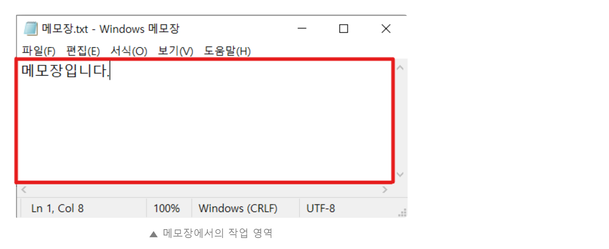

[bluestronica.github.io/WindowsAPI](https://bluestronica.github.io/WindowsAPI)

# 개요
- 기존 프로젝트를 실행하고 윈도우의 크기를 변경하면 사이즈는 바뀌지만, 내용은 그대로 있는 것을 알 수 있다. 사이즈를 줄이면 내용이 안보이는 상황이다. 대부분의 웹사이트를 접속하면 브라우저의 크기를 변경하면 크기에 맞게 내용이 이동하는 것을 본적이 있다. 
- 이는 크기가 바뀌어도 사용자가 내용을 확인할 수 있도록 반응형 웹사이트로 만든 것이다.
- Win32 API로 만든 윈도우도 이와 같은 기능을 구현 할 수 있다.


# 작업 영역(Client Area)



- 작업 영역이라 함은 위의 그림처럼 빨간색으로 표시된 곳이 작업 영역이다.
- 글을 쓰고, 지울 수 있는 영역으로 이 영역을 알고 있으면 사이즈에 맞춰 알맞은 기능을 구현할 수 있다.
- 예를 들면, 화면의 가운데에 글씨를 출력하거나 화면의 위에서 아래로 내려가는 기능을 구현할 수 있다.

### GetClientRect 함수
- 작업 영역을 얻기 위한 함수는 GetClientRect 함수이다.
- **`BOOL GetClientRect(HWND hWnd, LPRECT lpRect);`**
- 윈도우의 핸들과 작업 영역이 저장될 사각형의 주소 정보가 인수로 들어간다.
- 즉 hWnd가 갖고 있는 윈도우의 작업 영역이 lpRect에 저장되는 것이다.
- 타이머와 같이 함수가 사용되는 위치에 따라서 알맞게 활용될 수 있다.
- 크게 다음 세 개의 메세지에서 활용될 수 있다.
  - WM_CREATE
    - 프로그램이 실행될 때 최초 발생하는 메세지이다.    
  - WM_PAINT
    - 화면에 변화가 생겼거나 무효 영역(InvalidateRect 함수 등)이 생기면 발생하는 메세지이다.
  - WM_SIZE
    - 윈도우의 크기가 변화화면 발생하는 메세지이다.
    - 윈도우의 끝 부분에 마우스를 올리면 마우스가 화살표로 변화게 된다. 
    - 이 때, 클릭하고 움직이면 윈도우의 크기가 변환다. WM_SIZE 메세지가 발생하는 것이다.


# GetClientRect 함수를 통해 작업 영역 얻기
- 화면의 중앙에 "Center String"을 출력한다. 
- 원활한 실습을 위하여 윈도우의 크기를 변경한다
```c
hWnd = CreateWindow(lpszClass, lpszClass, WS_OVERLAPPEDWINDOW,
		CW_USEDEFAULT, CW_USEDEFAULT, CW_USEDEFAULT, CW_USEDEFAULT,
		NULL, (HMENU)NULL, hInstance, NULL);
```
- 위와 같이 두 번째 줄을 CW_USEDEFAULT를 넣는다.
- 이는, 운영체제가 판단해 적당한 크기의 윈도우를 생성하는 것이다.
- 각 인수는 첫 번째부터 X, Y, Width, Height 이다.

### WM_CREATE
- 프로그램 생성시 작업 영역을 얻어 문자열을 출력한다.
```c

```


