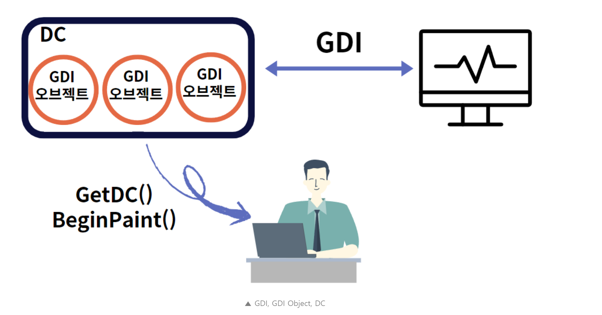

[bluestronica.github.io/WindowsAPI](https://bluestronica.github.io/WindowsAPI)

# GDI, GDI 오브젝트, DC의 개념
- GDI는 화면, 프린터와 같은 모든 출력 장치를 제어하는 인터페이스이다.
- 그래픽을 출력하기 위해 사용되는 도구를 GDI Object라고 한다.
- 펜, 브러쉬, 비트맵, 폰트 등이 GDI Object에 해당된다.
- 이러한 GDI Object는 DC(Device Context)에 담겨져 있다.
  - DC는 Win32에서 출력을 하기위한 Device Context라는 구조체이다.
  - 즉, 출력에 필요한 정보를 가지는 데이터 구조체이며 좌표, 색, 굵기 등 출력에 필요한 모든 정보를 담고 있다.
- DC에서 원하는 내용을 변경하여 출력한다.
- 그래서 여태까지 GetDC, BeginPaint와 같은 함수를 사용해 DC를 생성해 핸들을 얻어서 사용했던 것이다.

- GDI Object는 DC에 담겨저 있고 GDI를 통해 출력 장치에 출력을 하게 된다.
- 개발자는 GetDC, BeginPaint와 같은 함수를 통해 DC를 생성하게 된다.
  - GetDC는 지정한 윈도우(창)의 DC를 가져온다.
- GDI Object는 내부는 공개되어 있지 않기 때문에, 핸들을 이용해서 사용한다.
- 기본적으로 DC가 만들어졌을 때 디폴트로 선택된 GDI Object는 다음과 같다.

| GDI Object | 핸들 타입 | 설명 | 디폴트 |
|:---|:---|:---|:---|
|펜(Pen)|HPEN|선을 그을 때 사용된다.|검정색의 가는 선|
|브러쉬(Brush)|HBRUSH|면을 채울 때 사용된다.|흰색|
|폰트(Font)|HFONT|문자 출력에 사용되는 글꼴|시스템 글꼴|
|비트맵(HBITMAP)|HBITMAP|비트맵 이미지|선택되지 않음|
|팔레트(HPALETTE)|HPALETTE|팔레트|선택되지 않음|
|영역(RGN)|HRGN|영역|선택되지 않음|

### 스톡 오브젝트(Stock Object)
- 윈도우에서 기복적으로 제공하는 GDI Object를 스톡 오브젝트라고 한다.
- 스톡 오브젝트는 언제든 사용할 수 잇고, 사용 후에 해지않아도 된다는 특징이 있다.
- 핸들을 얻어 사용하면 되므로 편리하다는 장점이 있다.
- 반면, 사용자가 직접 만들어 사용하는 오브젝트는 꼭 해지해야 한다.
- **`HGDIOBJ GetStockObject(int fnObject);`**

| fnObject | 설명 |
|:---|:---|
|BLACK_BRUSH|검정색 브러쉬|
|GRAY_BRUSH|회색 브러쉬|
|NULL_BRUSH|투명 브러쉬|
|WHITE_BRUSH|**흰색 브러쉬(디폴트)**|
|DKGRAY_BRUSH|진한 회색 브러쉬|
|LTGRAY_BRUSH|연한 회색 브러쉬|
|BLACK_PEN|**검정색 펜(디폴트)**|
|WHITE_PEN|흰색 펜|
|NULL_PEN|투명 펜|
|ANSI_FIXED_FONT|고정폭 폰트|
|ANSI_VAR_FONT|가변폭 폰트|
|DEFAULT_PALETTE|시스템 팔레트|

# 스톡 오브젝트 활용과 색상
### GdiObject 프로젝트
- 여태까지 GDI 오브젝트 중 디폴트 값을 사용해서 선, 그림 등을 윈도우에 출력했다.
- 이번에는 스톡 오브젝트 중 브러쉬를 변경하여 사각형을 출력해본다.
```c
LRESULT CALLBACK WndProc(HWND hWnd, UINT iMessage, WPARAM wParam, LPARAM lParam)
{
	HDC hdc;
	PAINTSTRUCT ps;
	HBRUSH MyBrush, OldBrush;

	switch (iMessage)
	{
	case WM_CREATE:
		hWndMain = hWnd;
		return 0;
	case WM_PAINT:
		hdc = BeginPaint(hWnd, &ps);
		MyBrush = (HBRUSH)GetStockObject(GRAY_BRUSH);
		OldBrush = (HBRUSH)SelectObject(hdc, MyBrush);
		Rectangle(hdc, 30, 30, 200, 100);
		SelectObject(hdc, OldBrush);
		EndPaint(hWnd, &ps);
		return 0;
	case WM_DESTROY:
		PostQuitMessage(0);
		return 0;
	}
	return(DefWindowProc(hWnd, iMessage, wParam, lParam));
}
```
- 먼저, 브러쉬의 핸들을 얻는다. MyBrush, OldBrush 2개를 얻는 것을 확인할 수 있다.
- 이는 하나의 값은 무조건 가지고 있어야 하기 때문에, 기존 정보를 저장해두기 위함이다.
- WM_PAINT 메세지 처리 부분을 보면, BeginPaint 함수를 통해 DC를 생성해 핸들값을 hdc에 저장한다.
- GetStockObject 함수를 통해 스톡 오브젝트를 사용한다.
- 반환형이 int형이다. 핸들값을 사용하기 위해 BRUSH의 핸들인 HBRUSH로 명시적 형변환을 한다.
- 이후, SelectObject 함수를 통해서 기존 브러쉬 정보를 저장한다. 
- 이를 사용 후, 저장하고 있던 브러쉬 정보를 선택하고 마무리한다.
- 리소스를 반환하는(메모리를 삭제하는) 코드가 없다. 
- 이는, 윈도우에서 기본적으로 제공하는 스톡 오브젝트는 따로 리소스를 반환하지 않아도 되기 때문이다.(자동으로 되기 때문에)

### 색상
- Win32 API에서 색상은 COLORREF라는 DWORD형 구조체를 사용한다.
- RGB로 표현하며 각 빨가(RED), 초록(GREEN), 파랑(BLUE)의 색상 정보를 나타낸다.

