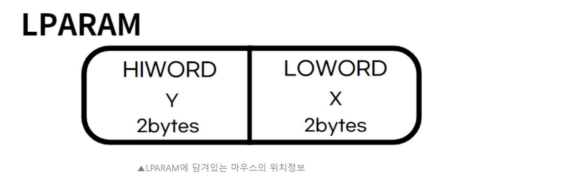

[bluestronica.github.io/WindowsAPI](https://bluestronica.github.io/WindowsAPI)

# 개요
- 키보드 입력을 통해 문자열을 화면에 출력하는 프로젝트를 작성했다.
- 이 과정에서 몇몇 변수를 static으로 선언하는 이유와 가상키 코드에 대해 알아봤다.

# 마우스 입력시 발생하는 메세지
- 마우스를 클릭하게 되면 해당 메세지가 발생하게 된다. 
- 마우스를 눌렀을 때, 마우스를 이동할 때, 더블클릭할 때, 눌렀다가 뗏을때 각각의 메세지가 발생한다. 
- 왼쪽 버튼을 눌렀는지, 오른쪽 버튼을 눌렀는지에 따라 각각의 메세지가 발생한다. 
- 마우스와 관련된 메세지는 다음과 같다.

| 버튼 | 누름 | 놓음 | 더블 클릭 |
|:---|:---|:---|:---|
| 왼쪽 버튼 | WM_LBUTTONDOWN | WM_LBUTTONUP | WM_LBUTTONDBLCLK |
| 오른쪽 버튼 | WM_RBUTTONDOWN | WM_RBUTTONUP | WM_RBUTTONDBLCLK |
| 중앙 버튼 | WM_MBUTTONDOWN | WM_MBUTTONUP | WM_MBUTTONDBLCLK |

- 메세지 루프에서 WM_LBUTTONDOWN 메세직 발생하면 윈도우 프로시저로 메세지가 전달된다.
- 이 때, 마우스가 클릭된 위치나 조합키의 상태(Shif, Ctrl 등)와 같은 부가 정보가 메세지와 함께 윈도우 프로시저로 전달된다.
- **`LRESULT CALLBACK WndProc(HWND hWnd, UINT iMessage, WPARAM wParam, LPARAM lParam)`**
- 부가 정보는 WPARAM, LPARAM에 담겨서 전달된다.

### LPARAM lParam
- 이 구조체는 WORD형 구조체이다. 4byte로 이루어져 있고, 
- 상위 2byte는 HIWORD, 하위 2byte는 LOWORD라고 한다.

- 위 그림처럼, 마우스의 위치 정보는 LPARAM의 HIWORD에 Y좌표, LOWORD에 X좌표가 담겨 윈도우 프로시저로 전달된다. 실제로 사용할 땐 (LOWORD(lParam), HIWORD(lParam))과 같이 사용할 수 있다.

### WPARAM wParam
- 마우스 버튼의 상태와 키보드 조합키의 상태가 전달된다.
- 상태값들의 비트 연산을 통해 여러 개의 조합키가 눌려도 윈도우가 이를 인식하고 알맞은 처리를 할 수 있는 것이다.

| 값 | 내용 |
|:---|:---|
| MK_CONTROL | Ctrl 키가 눌려있다. |
| MK_LBUTTON | 마우스 왼쪽 버튼이 눌려있다. |
| MK_RBUTTON | 마우스 오른쪽 버튼이 눌려있다. |
| MK_MBUTTON | 마우스 가운데 버튼이 눌려있다. |
| MK_SHIFT | Shift 키가 눌려있다. |


# 자유 곡선 그리기
- 마우스를 클릭해 글미을 그릴 수 있는 프로그램 작성

### Mouse1 프로젝트
- 마우스를 클릭하면, 마우스의 위치 정보를 최신화한다.
- 마우스를 움직이면 MoveToEx함수를 통해 최신화한 마우스의 위치 정보로 이동 한 뒤,
- 현재 위치로 LineTo함수를 통해 선을 그린다.

### 더블클릭 메세지
- **WindMain 함수에서 윈도우를 생성할 때, 더블클릭을 인식할 수 있도록 스타일을 설정해야한다.**
- 해당 설정을 안하면, 아무리 빨리 클릭을 하더라도 LBUTTONDOWN, RBUTTONDOWN 메세지가 많이 발생할 뿐, 더블 클릭 메세지가 발생하지 않는다.
```c
int APIENTRY WinMain(_In_ HINSTANCE hInstance, 
                     _In_opt_ HINSTANCE hPrevInstance, 
                     _In_ LPSTR lpszCmdParam, 
                     _In_ int nCmdShow)
{
	HWND hWnd;
	MSG Message;
	WNDCLASS WndClass;
	g_hInst = hInstance;

	WndClass.cbClsExtra = 0;
	WndClass.cbWndExtra = 0;
	WndClass.hbrBackground = (HBRUSH)GetStockObject(WHITE_BRUSH);
	WndClass.hCursor = LoadCursor(NULL, IDC_ARROW);
	WndClass.hIcon = LoadIcon(NULL, IDI_APPLICATION);
	WndClass.hInstance = hInstance;
	WndClass.lpfnWndProc = WndProc;
	WndClass.lpszClassName = lpszClass;
	WndClass.lpszMenuName = NULL;
	WndClass.style = CS_HREDRAW | CS_VREDRAW | CS_DBLCLKS;  // 더블클릭 인식!

	RegisterClass(&WndClass);

	hWnd = CreateWindow(lpszClass, lpszClass, WS_OVERLAPPEDWINDOW,
		CW_USEDEFAULT, CW_USEDEFAULT, CW_USEDEFAULT, CW_USEDEFAULT,
		NULL, (HMENU)NULL, hInstance, NULL);

	hWndMain = hWnd;
	ShowWindow(hWnd, nCmdShow);

	while (GetMessage(&Message, NULL, 0, 0))
	{
		TranslateMessage(&Message);
		DispatchMessage(&Message);
	}
	return (int)Message.wParam;
}

LRESULT CALLBACK WndProc(HWND hWnd, UINT iMessage, 
  	WPARAM wParam, LPARAM lParam)
{
	HDC hdc;
	static int x;
	static int y;
	static BOOL bNowDraw = FALSE;

	switch (iMessage)
	{
	case WM_LBUTTONDOWN:
			x = LOWORD(lParam);
			y = HIWORD(lParam);
			bNowDraw = TRUE;
			return 0;
	case WM_MOUSEMOVE:
		if (bNowDraw == TRUE)
		{
			hdc = GetDC(hWnd);
			MoveToEx(hdc, x, y, NULL);
			x = LOWORD(lParam);
			y = HIWORD(lParam);
			LineTo(hdc, x, y);
			ReleaseDC(hWnd, hdc);
		}
		return 0;
	case WM_LBUTTONUP:
		bNowDraw = FALSE;
		return 0;
	case WM_LBUTTONDBLCLK:
		InvalidateRect(hWnd, NULL, TRUE);
		return 0;
	case WM_DESTROY:
		PostQuitMessage(0);
		return 0;
	}
	return(DefWindowProc(hWnd, iMessage, wParam, lParam));
}
```


