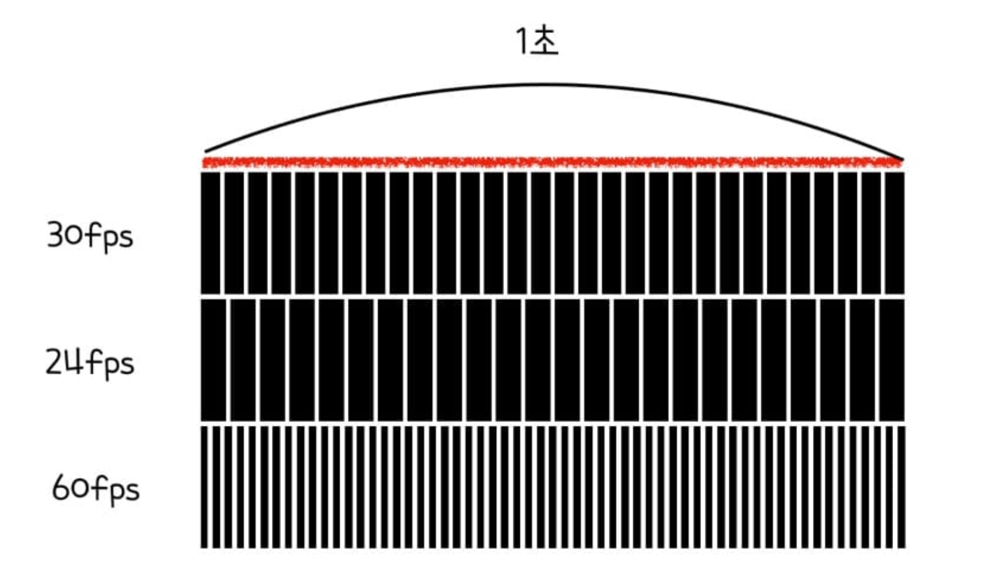
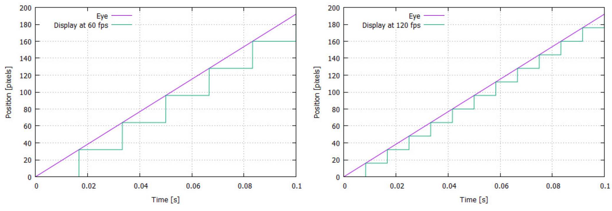
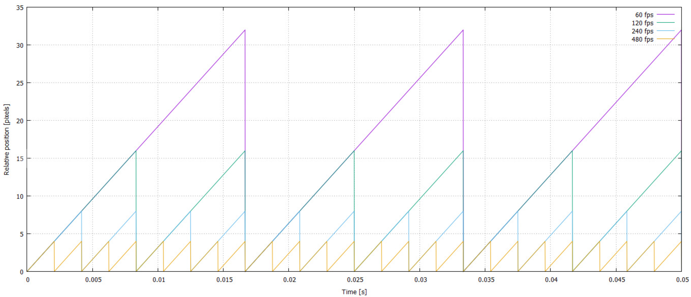

# Timer

### FPS(Frame Per Second) - 초당 프레임 수


| FPS | Frame time(s) | Frame time(ms) |
|:---|:---|:---|
|20|1/20|50ms|
|30|1/30|33.33ms|
|60|1/60|16.67ms|
|100|1/100|10ms|

### PPS(Pixels Per Second) - 초당 픽셀들 수
- 다양한 프레임 속도(frame rate)에 대한 다음 그래프 세트에서 초당 1920픽셀의 속도(PPS)로 시간에 눈의 위치와 표시된 개체를 플로팅했다.

- Absolute position of eye and displayed object


  - 보시다시피 물체의 표시된 위치는 선형 이동에 근사치만 적용하고 프레임 속도(frame rate)가 높을수록 근사치가 더 좋아진다. 눈과 표시된 개체의 위치는 프레임당 한 번만 일치한다. 표시된 물체와 눈의 상대적 위치(즉, 사람의 시야에서 물체의 인지된 위치)를 플로팅하면 다음 그래프를 얻을 수 있다.

- Relative position of eye and displayed object


  - 표시된 물체는 시야에서 주기적으로 앞뒤로 움직인다. 이 움직임은 진동(vibration)으로 설명될 수 있으므로 지금부터 이 용어를 사용한다. 이 진동(vibration)의 진폭(amplitude)은 프레임 속도(frame rate)가 증가함에 따라 감소하고 주파수(frequency)(1초 동안에 진동하는 수)는 프레임 속도와 동일하다는 것을 알 수 있다.

### 시간 동기화 하기
- 초당 1920픽셀 이동은 컴퓨터 속도가 아무리 빨라도 초당 1920픽셀, 아무리 느려도 초당 1920픽셀이 이동한다는 개념 자체가 실제 시간과 매칭된다는 의미이다.
- **1프레임당 픽셀 이동 거리 = PPS * 1Frame time**
- 1Frame time은 컴퓨터의 성능에 따라 달라질 수 있기 때문에 매번 1Frame time을 얻어와서 **1프레임당 픽셀 이동 거리**를 계산해낸다.
- 그리고 그것을 1초 동안 반복 합산하면 초당 1920픽셀의 총 이동량이 된다.

### QueryPerformance를 이용해 프로그램 실행 속도 측정
- 컴퓨터 메인보드의 고해상도 타이머를 이용해 시간 간격을 측정한다.
- **QueryPerformanceFrequency**
  - 현재 성능 카운터, 타이머의 주파수를 반환한다.
  - **1초당 진동 수(타이머의 주파수)이기 때문에 시간 개념이 들어간다.**
- **QueryPerformanceCounter**
  - 시간 간격 측정에 사용할 수 있는 고해상도 타임 스탬프인 성능 카운터의 현재 값을 반환
  - 즉, **현재 CPU의 틱**을 받아오는 것이다.
- 사용법
```C++
#include <windows.h>

int main()
{
	LARGE_INTEGER timer;
	LARGE_INTEGER start;
	LARGE_INTEGER end;
	float DeltaTime;
	
	QueryPerformanceFrequency(&timer);  // 타이머의 주파수를 얻어온다.
	QueryPerformanceCounter(&start);    // 시작 시점의 CPU 클릭 수
	
	
	// 실행할 내용
	
	QueryPerformanceCounter(&end);  // 종료 시점의 CPU 클릭 수
	DeltaTime = (end.QuadPart - start.QuadPart) / (float)timer.QuadPart;
	
	// 시작점과 끝지점에서 QueryPerformanceCounter 함수를 호출하면
	// 수행시간동안 발생한 진동수를 얻을 수 있다.
	// 그러나 이 값은 시간 단위가 아니므로
	// 시간 개념이 들어간 
	// QueryPerformanceFrequency 함수로 얻은 주기(1초당 진동 수) 값으로
	// CPU의 틱을 나누어 시간 단위로 변환한다.
}
```
  
### CTimeMgr
```C++
// CTimeMgr.h

class CTimeMgr
{
	SINGLE(CTimeMgr);
private:
	LARGE_INTEGER	m_llCurCount;  
	// QueryPerformanceCounter로 부터 얻는 현재 카운트 값(백만단위)
	
	LARGE_INTEGER	m_llPrevCount; // 이전 카운트
	LARGE_INTEGER	m_llFrequency; // 1초가 동안 카운트를 세어 나타낸 값

	double		m_dDT;		// 프레임 사이의 시간 값
	double		m_dAcc;  	// 1초 체크를 위한 누적 시간
	UINT		m_iCallCount;	// 함수 호출 횟수 체크
	UINT		m_iFPS;		// 초당 호출 횟수


	// FPS : 1초동안 프레임 개수를 알면 1 프레임당 시간을 알 수 있다.
	// 1 프레임당 시간 , 아주 미세한 시간 데이터 타입, (Delta Time)

	// 1초에 천식 세는 겟틱카운트함수 이걸로 카운트에 현재 카운트와 
  	// 일정시간 지난뒤 카운트를 또 체크해서
	// 벌어진 벌어진 차이 값을 천으로 나눠서 실제 현실 시간이 얼마나 
  	// 흘렸는지를 체크해 줄 수 있었다.

public:
	void init();
	void update();  // 매 프레임마다 호출하는 함수

public:
	double GetDT() { return m_dDT; }
	float GetfDT() { return (float)m_dDT; }
};
```

```C++
// CTiMgr.cpp

CTimeMgr::CTimeMgr()
	: m_llCurCount{}
	, m_llPrevCount{}
	, m_llFrequency{}
	, m_dDT(0.)
	, m_dAcc(0.)
	, m_iCallCount(0)
	, m_iFPS(0)
{
}

CTimeMgr::~CTimeMgr()
{
}

void CTimeMgr::init()
{
	// 현재 카운트
	QueryPerformanceCounter(&m_llPrevCount);     
	// 100만 단위의 초당 세는 카운트
	
	// 초당 카운트 횟수
	QueryPerformanceFrequency(&m_llFrequency);  
	// 1초가 벌어졌을 때 카운트 값 차이가 얼마나 나는지도 구해 와야 한다.
	// 1초당 카운트가 얼마나 발생하는지에 대한 프리퀀시 값을 얻겠다는 것이다.
	// 초당 셀 수 있는 카운트 양 ; 프리퀀시 안에 시간 개념이 들어가 있다
}

void CTimeMgr::update()   // 매 프레임마다 호출
{
	// 매번 업데이트마다 한 프레임에 걸린 시간을 구한다.  
	// 1 프레임 호출되는 데 걸린 시간
	QueryPerformanceCounter(&m_llCurCount);

	// 차이 값; QuardPart는 실제 long long 타입의 자료 데이터이다
	// 프레임과 프레임 사이에 걸린 시간에 카운트 차이 벌어진 값을 알 수 있다.
	// 이전 프레임 카운팅과, 현재 프레임 카운팅 값의 차이를 구한다.
	m_dDT = (double)(m_llCurCount.QuadPart 
		- m_llPrevCount.QuadPart) / (double)m_llFrequency.QuadPart;

	// 이전 카운트를 현재 카운트 값으로 갱신(다음번에 계산을 위해서)
	m_llPrevCount = m_llCurCount;

	++m_iCallCount;
	m_dAcc += m_dDT;	// DT 누적; 흘러간 시간

	// 1초가 되었을 때 카운트 세기
	if (m_dAcc >= 1.)
	{
		m_iFPS = m_iCallCount;  // 1초동안에 이 함수 몇번 호출 되었는지

		m_dAcc = 0.;
		m_iCallCount = 0;

		wchar_t szBuffer[2550] = {};

		swprintf_s(szBuffer, L"FPS : %d, DT : %f", m_iFPS, m_dDT);
		SetWindowText(CCore::GetInst()->GetMainWwnd(), szBuffer);
	}

	// 한 프레임에 걸린 시간 값은
	// 이전 프레임과 현재 프레임의 카운트 차이 값이 
		: 프레임과 프레임 사이 많은 시간이 흐른다
	// 1초 동안 내가 셀수 있는 프리퀀시 값으로 나누었을 때 
	// 그게 바로 실제 시간이 된다.
}
```


