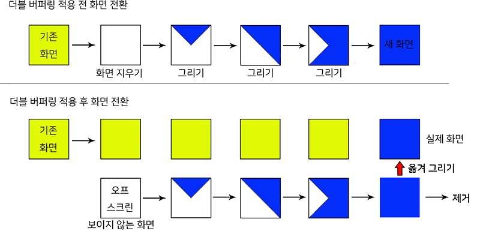

# Double Buffering
- 더블 버퍼링은 화면에 표시해야 할 내용을 미리 메모리에 모두 그려놓은 후 화면으로 한꺼번에 전송하는 방법을 말한다.
- 즉, 어떠한 내용을 그릴 때, 매번 화면으로 출력을 보내는 것이 아니라, 화면으로 내보일 내용을 미리 메모리에 모두 그려 놓은 후 그것을 한꺼번에 화면으로 딱 한 번 그려내자는 것이다. 
- Double Buffering은 copy와 flip의 2가지 기법이 있다.

### Double Buffering - copy(BitBlt)


- 이중 버퍼링 용도의 비트맵과 DC를 만든다.
```c++
m_hBit = CreateCompatibleBitmap(m_hDC, m_ptResolution.x, m_ptResolution.y);
m_memDC = CreateCompatibleDC(m_hDC);

// m_hBit와 m_memDC 연결
HBITMAP hOldBit = (HBITMAP)SelectObject(m_memDC, m_hBit);
DeleteObject(hOldBit);
```
- **CreateCompatibleDC**
  - 어떤 DC와 호환(Compatible) 되는 DC를 만드는 방식이다.
  - 매개 변수로 전달된 hdc와 호환이 된다라는 뜻은 hdc가 사용하는 출력 장치의 종류나
  - 출력장치가 사용 중인 그래픽 드라이버 정보를 가지고 있는 새로운 DC를 만든다는 뜻이다.
  - 따라서 이렇게 만들어진 DC는 DC에 연결된 비트맵에 그림을 그릴 때 hdc와 동인한 방법으로 그림을 그리게 된다.
  - CreateCompatibleDC를 사용해서 얻은 DC는 출력 대상이 없는 상태로 그리기 특성만 정해져서 만들어지기 때문에 비트맵 객체가 연결은 되어 있지만 제대로 된 비트맵 객체는 아니다.
  - CreateCompatibleDC 함수로 만든 DC에 연결된 비트맵 객체 정보를 얻어보면 1비트 색상에 폭과 높이가 1인 비트맵이라는 것을 확인할 수 있다. 
  - 결국 사용하라고 연결한 비트맵 객체가 아니라 그냥 DC를 구성하기 위해서 연결한 비트맵이라는 것이다.
  - 따라서 CreateCompatibleDC로 생성한 DC를 사용하려면 비트맵 객체를 만들어서 연결하는 작업을 먼저 해야한다.
- **CreateCompatibleBitmap**
  - 비트맵을 만든다.
- **SelectObject**
  - 메모리 DC와 비트맵 객체 연결

- 메모리에 그려 놓은 후 실제 화면에 복사 옮겨 그리기 
```c++
Rectangle(m_memDC, -1, -1, m_ptResolution.x + 1, m_ptResolution.y + 1);

// 그리기
Vec2 vPos = g_obj.GetPos();
Vec2 vScale = g_obj.GetScale();

// m_memDC와 연결된 m_hBit에 사각형을 그린다. 이 그림은 화면에 출력되지 않는다.
Rectangle(m_memDC, int(vPos.x - vScale.x / 2.f),
         int(vPos.y - vScale.y / 2.f),
         int(vPos.x + vScale.x / 2.f),
         int(vPos.y + vScale.y / 2.f));

// Memory DC와 화면 출력용 DC를 사용하여 비트맵에 그려진 그림을 복사하여 화면에 출력
BitBlt(m_hDC, 0, 0, m_ptResolution.x, m_ptResolution.y
  , m_memDC, 0, 0, SRCCOPY);
```
